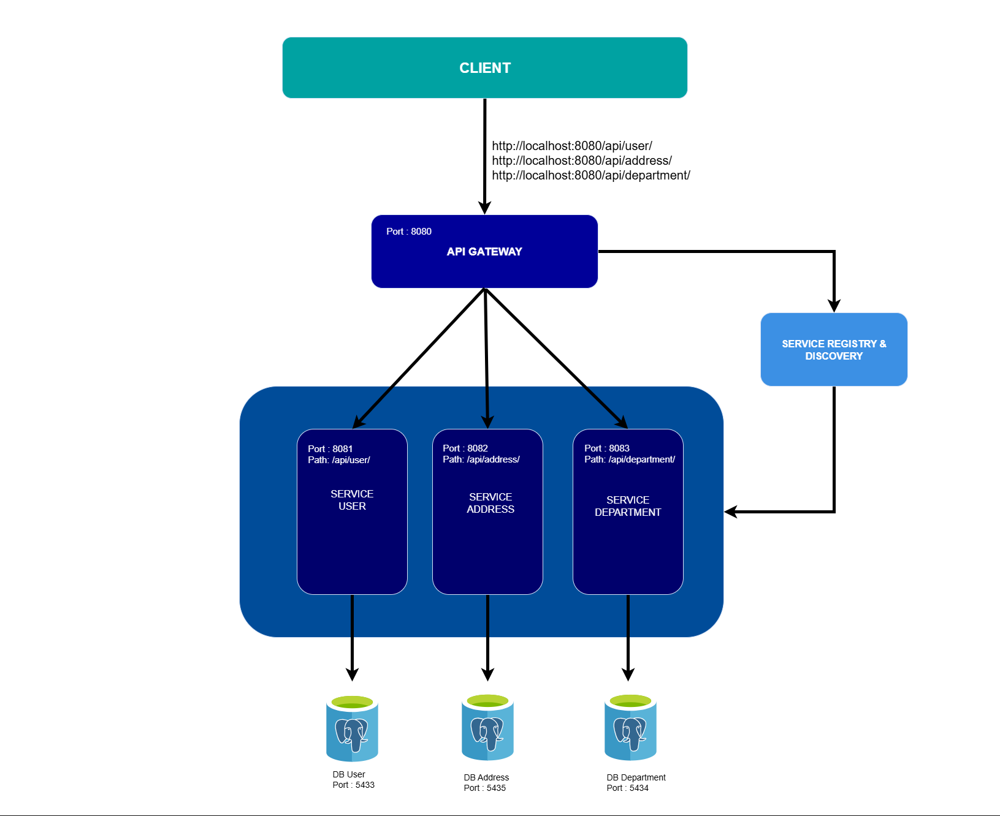

# Microservices Architecture: (Spring Boot + PostgreSQL + API Gateway + Eureka + Docker + Swagger)

This project is an implementation of a microservices architecture that divides the application into a set of small, independent, and separate services. Each service has a specific responsibility and can be developed and tested individually. This approach simplifies scalability and streamlines the management and maintenance of the overall system.

This project implements a microservices architecture using:

- Spring Boot (Web & WebFlux)
- PostgreSQL
- API Gateway (Spring Cloud Gateway)
- Eureka Server (Service Registry & Discovery)
- Docker


## Architecture Diagram

<p align="center">
  
</p>


## Services Overview

- api-gateway – Routes requests to the appropriate service
- eureka-server – Service registry (for registration and lookup of services)
- user-service – Manages user data
- department-service – Manages department data
- address-service – Manages address data


## Dependencies

### Api-Gateway
- `spring-cloud-starter-gateway-server-webflux`  
- `spring-boot-starter-webflux`  
- `spring-cloud-starter-netflix-eureka-client`  
- `springdoc-openapi-starter-webflux-ui`  


### Eureka Server
- `spring-boot-starter-web`  
- `spring-cloud-starter-netflix-eureka-server`  
- `spring-boot-starter-actuator`


### Service-User
- `spring-boot-starter-web`  
- `spring-boot-starter-data-jpa`
- `spring-boot-starter-webflux`  
- `spring-cloud-starter-netflix-eureka-client`
- `spring-cloud-starter-loadbalancer`
- `springdoc-openapi-starter-webmvc-ui`
- `postgresql`  
- `lombok`  

### Service-Department
- `spring-boot-starter-web`  
- `spring-boot-starter-data-jpa`  
- `spring-cloud-starter-netflix-eureka-client`
- `springdoc-openapi-starter-webmvc-ui`
- `postgresql`  
- `lombok`  

### Service-Address
- `spring-boot-starter-web`  
- `spring-boot-starter-data-jpa`  
- `spring-cloud-starter-netflix-eureka-client`
- `springdoc-openapi-starter-webmvc-ui`
- `postgresql`  
- `lombok`  


## Database

Each service has its own separate PostgreSQL database:
- userdb
- departmentdb
- addressdb


## Configuration


### api-gateway (application.yml)
```yaml
server:
  port: 8080

spring:
  application:
    name: api-gateway

  cloud:
    gateway:
      server:
        webflux:
          routes:
            - id: user-service
              uri: lb://user-service
              predicates:
                - Path=/api/user/**
              filters:
                - RewritePath=/api/user/(?<segment>.*), /api/user/${segment}
            - id: address-service
              uri: lb://address-service
              predicates:
                - Path=/api/address/**
              filters:
                - RewritePath=/api/address/(?<segment>.*), /api/address/${segment}
            - id: department-service
              uri: lb://department-service
              predicates:
                - Path=/api/department/**
              filters:
                - RewritePath=/api/department/(?<segment>.*), /api/department/${segment}

springdoc:
  swagger-ui:
    urls:
      - url: /api/user/v3/api-docs
        name: User Service
      - url: /api/address/v3/api-docs
        name: Address Service
      - url: /api/department/v3/api-docs
        name: Department Service

eureka:
  client:
    service-url:
      defaultZone: ${EUREKA_CLIENT_SERVICEURL_DEFAULTZONE:http://eurekaserver:8761/eureka/}
    register-with-eureka: true
    fetch-registry: true
```

### eureka-server (application.yml)

```yaml

server:
  port: 8761

spring:
  application:
    name: eureka-server

management:
  endpoints:
    web:
      exposure:
        include: health,info
  endpoint:
    health:
      show-details: always

logging:
  level:
    com.netflix.discovery: DEBUG

eureka:
  client:
    register-with-eureka: false
    fetch-registry: false

```

### user-service (application.yml)

```yaml
server:
  port: 8081

spring:
  application:
    name: user-service
  datasource:
    url: ${SPRING_DATASOURCE_URL}
    username: ${SPRING_DATASOURCE_USERNAME}
    password: ${SPRING_DATASOURCE_PASSWORD}
  jpa:
    hibernate:
      ddl-auto: update
    show-sql: true
    properties:
      hibernate:
        dialect: org.hibernate.dialect.PostgreSQLDialect

springdoc:
  api-docs:
    path: /api/user/v3/api-docs
  swagger-ui:
    path: /swagger-ui.html
    enabled: true

eureka:
  client:
    service-url:
      defaultZone: ${EUREKA_CLIENT_SERVICEURL_DEFAULTZONE:http://eurekaserver:8761/eureka/}
    register-with-eureka: true
    fetch-registry: true

```

### address-service (application.yml)
```yaml
server:
  port: 8082

spring:
  application:
    name: address-service
  datasource:
    url: ${SPRING_DATASOURCE_URL}
    username: ${SPRING_DATASOURCE_USERNAME}
    password: ${SPRING_DATASOURCE_PASSWORD}
  jpa:
    hibernate:
      ddl-auto: update
    show-sql: true

springdoc:
  api-docs:
    path: /api/address/v3/api-docs
  swagger-ui:
    path: /swagger-ui.html
    enabled: true

eureka:
  client:
    service-url:
      defaultZone: ${EUREKA_CLIENT_SERVICEURL_DEFAULTZONE:http://eurekaserver:8761/eureka/}
    register-with-eureka: true
    fetch-registry: true
```

### department-service (application.yml)
```yaml
server:
  port: 8083

spring:
  application:
    name: department-service
  datasource:
    url: ${SPRING_DATASOURCE_URL}
    username: ${SPRING_DATASOURCE_USERNAME}
    password: ${SPRING_DATASOURCE_PASSWORD}
  jpa:
    hibernate:
      ddl-auto: update
    show-sql: true

springdoc:
  api-docs:
    path: /api/department/v3/api-docs
  swagger-ui:
    path: /swagger-ui.html
    enabled: true

eureka:
  client:
    service-url:
      defaultZone: ${EUREKA_CLIENT_SERVICEURL_DEFAULTZONE:http://eurekaserver:8761/eureka/}
    register-with-eureka: true
    fetch-registry: true
```


## Docker & Deployment

This project is fully integrated with:

- Docker for containerization
- Automated health checks and restart policies
- To run all services together:


## Run Project
```
docker-compose up --build
```

## Stop Project
```
docker-compose down
```


## API Documentation (Swagger UI)

The API documentation using Swagger UI can be accessed at the following base URL:
```
http://localhost:8080/swagger-ui/index.html
```

## API Endpoints

All requests are sent through the API Gateway at:
```
http://localhost:8080.
```


### Service: Address 

Base URL: `http://localhost:8080/api/address`

| Method | Endpoint                 | Description         |
|--------|--------------------------|---------------------|
| GET    | `/getAllAddress`         | Get all addresses   |
| GET    | `/getAddressById/{id}`   | Get address by ID   |
| POST   | `/addAddress`            | Create new address  |
| PUT    | `/updateAddress/{id}`    | Update address      |
| DELETE | `/deleteAddress/{id}`    | Delete address      |


### Service: Department 

Base URL: `http://localhost:8080/api/department`

| Method | Endpoint                    | Description          |
|--------|-----------------------------|----------------------|
| GET    | `/getAllDepartment`         | Get all departments  |
| GET    | `/getDepartmentById/{id}`   | Get department by ID |
| POST   | `/addDepartment`            | Create new department|
| PUT    | `/updateDepartment/{id}`    | Update department    |
| DELETE | `/deleteDepartment/{id}`    | Delete department    |


### Service: User

Base URL: `http://localhost:8080/api/user`

| Method | Endpoint              | Description      |
|--------|-----------------------|------------------|
| GET    | `/getAllUser`         | Get all users    |
| GET    | `/getUserById/{id}`   | Get user by ID   |
| POST   | `/addUser`            | Create new user  |
| PUT    | `/updateUser/{id}`    | Update user      |
| DELETE | `/deleteUser/{id}`    | Delete user      |